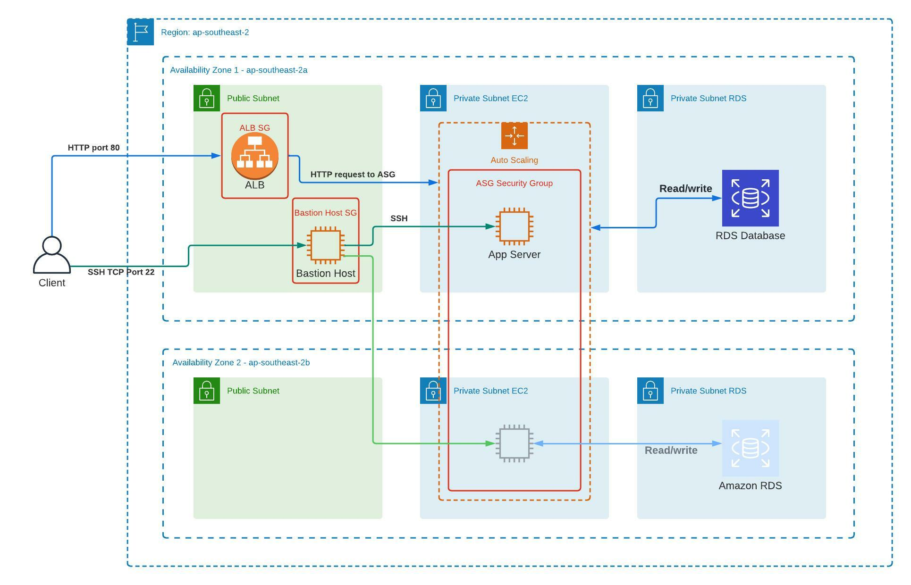

# TechChallengeApp-Vel
Submission for Servian's [TechChallengeApp](https://github.com/servian/TechChallengeApp) by Vel. 

**Date Submitted**: 2022-02-07

**Latest Update**: 2022-02-16

## Documentations

- [readme.md](readme.md)
  Current file

- [doc/adr](doc/adr) folder
  Architecture Design Records (ADR), details on why can be found in the [first entry](doc/adr/0001-record-architecture-decisions.md)

  Naming convention: `###-<decision title>` where the first 3 digits are iterated by 1 for each record.

## Deployment

The deployment of the app is made done on AWS using Terraform. ([helm_charts/tech-challenge-app](helm_charts/tech-challenge-app) folder)



### Deploy Requirements

- Terraform. [Guide to install here.](https://learn.hashicorp.com/tutorials/terraform/install-cli)

I have Terraform v1.1.5 installed on my local machine.

- AWS access key and secret key retrieved from created IAM role. [Instructions can be found here.](./guides/aws.md) 


### Configuring

- Clone Repo and cd to [terraform folder](./terraform/).

```
cd TechChallengeApp-Vel/terraform
```
- Seed user.tfvars by copying over `user.tfvars.example` > `user.tfvars`. Example is given on the file.

```
# Assuming we are still on TechChallengeApp-Vel/terraform dir:

mv user.tfvars.example user.tfvars
```

- If you wish to save the tfstate on AWS instead, create an S3 bucket, copy over `backend_seed/backend.tf` file and configure backend_bucket on `users.tfvars` file.

```
# Assuming we are still on TechChallengeApp-Vel/terraform dir: 

cp ../backend_seed/backend.tf .
```

- Initialise our deployment (make sure you're still on terraform directory)

```
terraform init
```

- Plan the deployment and validate beforehand.

```
terraform validate

terraform plan -var-file="user.tfvars"
```

### Deploying to AWS

Deploy with terraform 

```
terraform apply -var-file="user.tfvars"
```

The app might take up to 5 minutes after deployment is completed.

### Access the app

Once completed, terraform will output the lb_dns_name, and you may access the application from internet-connected browser on port 80.

*Example Output Logs:* 

```
Apply complete! Resources: 23 added, 0 changed, 0 destroyed.

Outputs: 
lb_dns_name = "app-lb-<uid>.ap-southeast-2.elb.amazonaws.com"
```

### Cleanup

Run destroy on terraform
```
terraform destroy -var-file="user.tfvars"
```

## Challenges and Known Issues

### Version Control

I am working mostly on dev branch, only merging to main for releases. Chances are I might still be working on this interesting project in the near future so keep an eye out for the dev branch if there are any updates.

### Password Management

Currently users have to seed user.tfvars and apply with password stored in plaintext -> a better way would be using IAM roles to authenticate between EC2 instances and PostgreSQL RDS.

### Serving the App

App is served and database initiated each time EC2 instances with user-init script, including initialisation of DB.
It can be further improved/scaled with decoupling inputs with SQS queues, but that would be out of scope of this task.

### HTTP/HTTPS redirection

It is possible to configure this since we are using ALB, however it will be out of scope on this challenge.

### Discoveries

- ADR (Architecture Design Records).
- Terraform syntax differences to declare variables.
- Application of knowledge on AWS SAA certificate training 

### For Further Consideration (out of scope)

- Decoupling messages between app block and db block with message queues
- DB access can be done via IAM roles instead.
- Passwords can be kept and rotated with Secrets Manager.
- Tightening security with NACL rules (allow ephemeral ports only, setting in line with security groups, etc) and enabling CloudTrail for DB access.
- Serving DB and initialising it can be done with Systems Manager or Lambda functions.
- REST APIs can be configured for end users to interact with the application tier. 
- Monitoring with cloudwatch.

### Update Logs
- 2022-02-16 
  - Systems diagram of the submission created on LucidChart under [resources directory.](./resources/sys-diagram-v1.jpeg)
  - ADR [006 - provisioning-in-aws_2](./doc/adr/006-provisionining-in-aws_2.md) is added as a revision for [002](./doc/adr/002-provisionining-in-aws.md), citing several considerations and decisions made for EC2, ALB and RDS.
  - Fixed typos on this readme page.