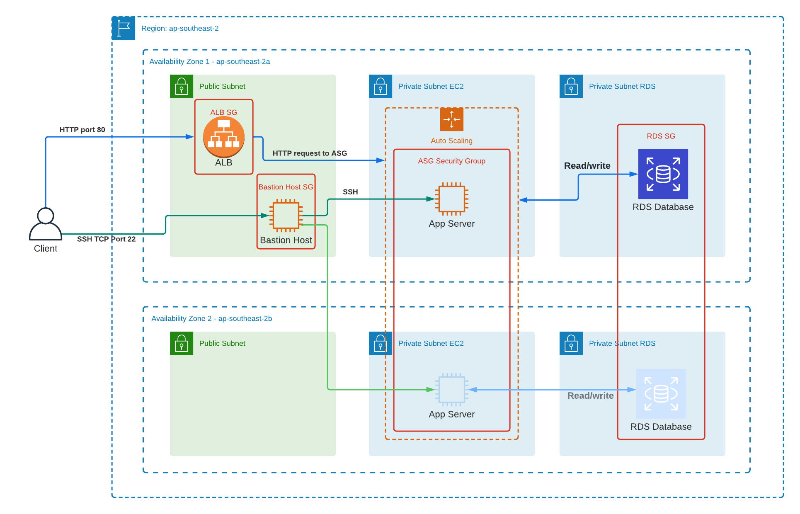

# 6. Provisioning in AWS (2) 

Date: 2022-02-16

## Status

Accepted, revision on 22-02-16 for ADR (2)

## Context

It is necessary to select the proper cloud provider considering these key aspects:

- Cost 

- Time to deployment

- Familiarity

- Supportability

## Decision

AWS is chosen as the deployment IaaS/PaaS provider of choice.

There will be:
- **Region**: ap-southeast-2 (for latency).

- 6 subnets: 2 public, 2 private (EC2), 2 private (RDS) spanning 2 AZ.

- Consequently, the stack will comprise of ALB block on public subnet, App block on the EC2 private subnet, DB block on RDS private subnet

- EC2 considerations:
  - Will be provisioned across 2 AZ's private subnets of its own.
  - EC2 Auto Scaling Group is used over Kubernetes/Docker or even serverless due to familiarity.
  - EC2 ASG is set to autoscaling_group_min_size = 1 and autoscaling_group_max_size = 1 for this exercise. If the EC2 instance is down, ASG will provision a new one on another AZ (since that would be the one with the latest config version)

- ALB is provisioned on public subnets, users will interface with DNS name generated.

- RDS is provisioned across 2 AZ's private subnets similar to EC2, but will be multi_az is set to false with master on AZ1 on this exercise.

- System Diagram now enclosed in Readme and below: 
  
  

## Consequences

- **Cost**: $$$ if not on free tier. Since ap-southeast-2 is chosen due to latency, I have to apply and destroy to ensure cost effective measures.

- **Time to deployment**: Constructing each component one by one is lengthy

- **Familiarity**: I've just passed my AWS SAA cert so that would be excellent to demonstrate my learning

- **Supportability**: A plethora of resources on the net, however the problem lies on the need to select the ones best suited for our case.